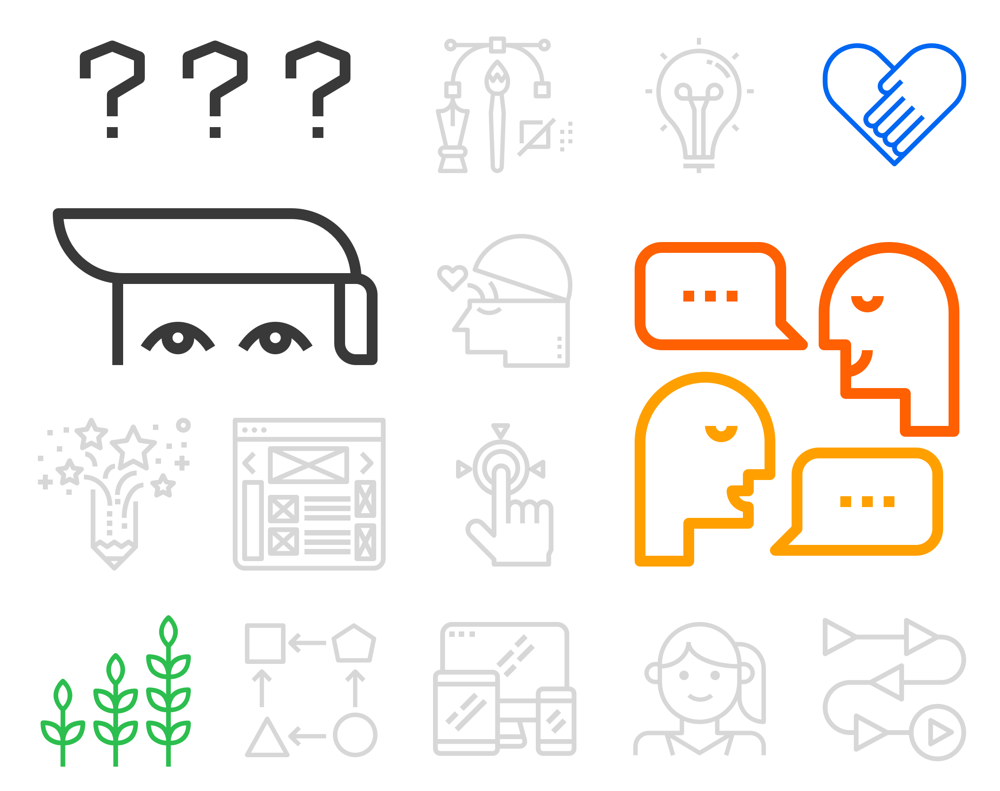

# Design Research at Accreditron

## Why is design needed?

Everybody has experienced bad software before. Websites, apps, or programmes which:

* Were _frustratingly_ confusing
* Didn't do what you really needed them to do
* Made your work harder
* Made it feel like it was your fault

This is a result of poorly designed software. We want Accreditron to be the best it possibly can be, and for it to work effectively it needs to be simple, easy to use, and empowering - everything bad software isn't. 

That's what this website is about! It's a transparent, detailed, behind-the-scenes look at the design work going into Accreditron. We hope you find it useful. 

### The disconnect between users and stakeholders

Accreditrion is a web platform for New Zealand's Social Sector. Our **users** are spread across New Zealand's social sector, and our **stakeholders** are spread across government.  
  
We think Accreditron should be zero cost to the social sector. This means, like many enterprise software companies, the stakeholders funding Accreditron are not representative of all the users that will engage with the product. Instead, funding stakeholders might be the management, government leadership, or funding organisations. 

> Because of this difference in incentives, a disconnect can form between what the funding **stakeholder wants** and what the **users need**.

Design research is an essential contributor to our success and why we take design and evidence-based decision making seriously. It also allows us to keep the voice of all users at the table and supports us to build our product directly for the people using it. _It’s all about collaboration and communication._

## Usability Research {#42f9}

Usability research is the process of researching and interviewing people who interact with Accreditron. From gathering broad data on their problems or journey — to detailed research like watching a person perform a task to understand their thought process.

For every component on Accreditron, we first research why we should build it and test our assumptions. Then after we design or build something worth testing, we research and measure how our solution performed against our original assumptions. With those results, we can make changes to improve the experience and repeat the process. This is sometimes referred to as the build-measure-learn cycle.

Usability research is one option for gathering data and measuring performance. By holding many usability sessions and interviews, we can pull all of the information together to develop insights across a sample group. Then use these gathered insights to drive the design of Accreditron and provide validation where possible.

## What have we tested?

We have done a large range of design research, but these have been our largest research projects. 







## Who did we test with?

#### Social Service Providers

Organisations, mostly NGOs and Charities, that deliver social services to individuals.

#### Public Servants 

Individuals that span many levels of government across: Social Sector Accreditation Team, Government Contract Management Teams, Procurement Teams, Researchers, Leadership, Ministers, and more.

#### Third Party Charitable Funders

Individuals who go through similar process to fund the Social Sector but are not acting on behalf of the crown.

> As a whole, charities that deliver social services only receive about 50% of their funding from government. The other 50% is from non government sources.
>
> Source: 2015 Productivity Commission Report

**Continue to next section:**



