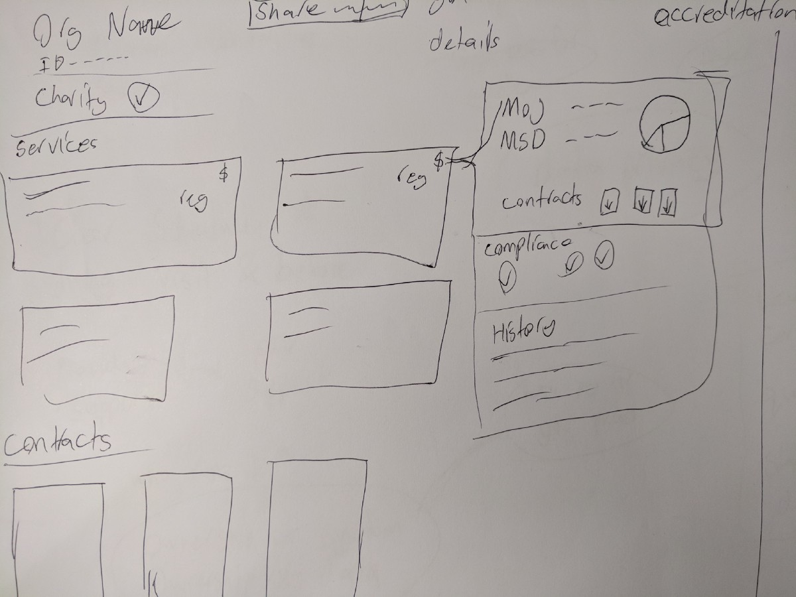

# Provider Co-design Workshop 1

August 21, 2017

Co-sponsored by SSPA, we had a great turn out of six national social service providers and representatives from Ministry for Social Development.

## Agenda

* Presentation of MSD Survey and Hui with 50 social service providers
* Demonstration of current state of Accreditron
* Facilitated design activities to prototype and develop ideas ~2hours

## Insights

Insights were gathered based on information collected from the workshop. Below outlines the highest valued insights to the group.

### Privacy

> Providers need to control their sharing settings, know who can see their information and why.

### Communication

> Build relationship with one lead contact person, the assessor, via platform messages.

### Integrations

> Ability to use Accreditron within current processes and have the ability to integrate with their current systems

### Contracts

> Ability to show funders what services are funded by whom and to what extent.

### Accessibility

> Providers stress it should be a free service, funded by government.

### Due-dilligence, RFP, and Contracting

> Ability to use Accreditron for more than just the Accreditation Process. Accreditron should be able to send information for due-dilligence, RFP, and contracting processes. For example, when a provider is working on a proposal for funding.

## Outcome

One of the activities in the co-design session was to draw the ideal system that fits their organisational needs. This is where the first mock-up and design for an inter-agency profile for born.

### Inter-agency Provider Profile

Providers expressed the need to be able to show:

* What services their organisation offers, even ones not funded by government.
* Where their funding is coming from to show the full picture of how their services are funded.
* Who their contacts are.
* What processes their organisation go through. 

The Inter-agency Provider Profile was created to be a way for an organisation to share top level information about their organisation to authorised parties. Later iterations of the provider profile were testing with social service providers and the all-of-government co-design working group.  

**Continue to next section:**



