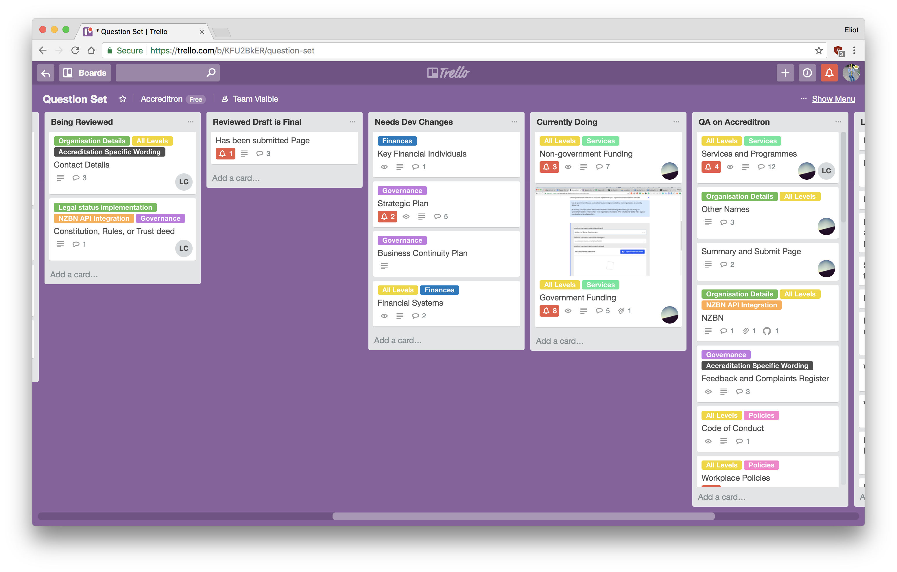

# Assessor Working Group

## Overview

The assessor working group is a team of five experienced assessors, one from each Accreditation region. We regularly have online check-ins to provide  design feedback from their perspective, ensuring the product is fit for the Accreditation process.

## Current Work

### Questions Set

Our first focus was working on the questions. The pre-assessment process is a series of questions, and we learnt from our [first trial](../trials/usability-trial-1/), that the questions had the largest impact on the experience of the product. 

There are many factors which make a good question

1. Does this question help prove an Accreditation standard?
2. Is it clear and explicit about what information is needed?
3. Is that information easy to collect?
4. Is the question written using plain english?

Assessors have an experienced understanding of the Accreditation process. They've provided us with insights about the questions we wouldn't have been able to get anywhere else, such as:

* "This question is a lot of work to complete, particularly for large providers"
* "This document is usually stuck to a wall - a provider could submit a copy now, but it's most likely a photo not a scan. Reword to make it clear a photo is fine"
* "While we've traditionally asked for this, this question isn't actually that useful"
* "While that's the technical term for that document, some providers would know it by it X"

We track the question set in Trello, to ensure the discussion around questions is maintained and decisions can be reviewed.

### Upcoming work

* Question sets for level 4
* Question set for speciality standards
* Feedback on workflow tools
* Alpha Testing

